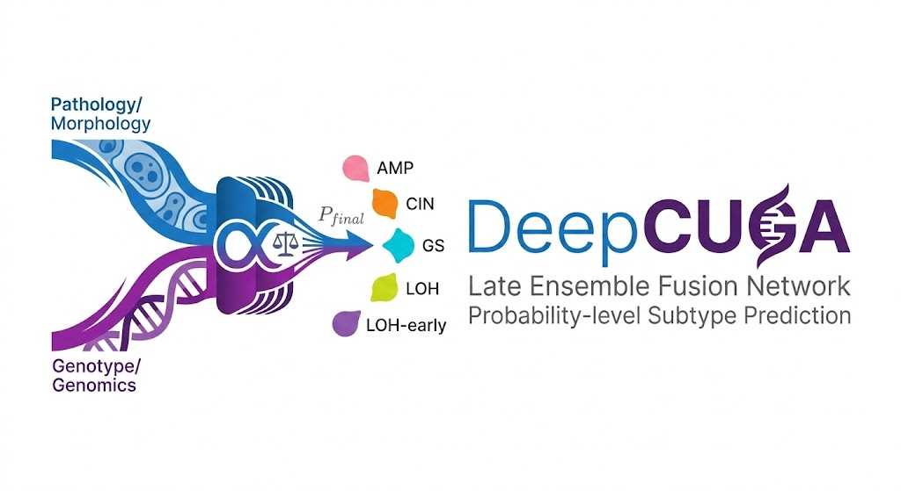

---

# DeepCUGA: A Probability-level Late Ensemble Architecture for Subtype Prediction

DeepCUGA is a multi-task Multiple Instance Learning (MIL) framework designed to model the relationship between histopathological phenotypes and whole-genome architecture. By leveraging whole-slide images (WSIs), DeepCUGA integrates morphology-driven and genotype-informed pathways to predict molecular subtypes and key genomic events simultaneously.
 
## 🧬 Overview

Traditional computational pathology models often rely on direct feature extraction for classification. DeepCUGA introduces a **Probability-level Late Ensemble Fusion** strategy to explicitly decouple morphological features from genotype features.

The architecture consists of:

1. **CONCH-based Feature Encoding:** Patch-level features (512-dim) are extracted using the CONCH vision-language foundation model.
2. **TransMIL Backbone:** Contextual spatial dependencies are modeled using a Pyramidal Position Encoding Generator (PPEG) and Nyströmformer layers.
3. **Morphology-driven Branch:** Maps the global classification token ($Z_{cls}$) directly to subtype probabilities ($P_{path}$).
4. **Genotype-informed Branch:** Predicts the presence of 5 key genomic events (WGD, Chromothripsis, ecDNA, TP53, FGFR3) to form a genomic probabilistic bottleneck ($V_{genomic}$), which is then mapped to genotype-informed subtype probabilities ($P_{geno}$).
5. **Dynamic Weighted Fusion:** Final predictions are derived via $P_{final} = \alpha P_{path} + (1-\alpha) P_{geno}$, where the optimal fusion coefficient $\alpha$ is dynamically determined via grid search on the validation set.

## 📁 Repository Structure

```text
DeepCUGA/
├── main_CUGA.py           # Main entry point for training and K-Fold cross-validation
├── TransMILCUGA.py        # Core model architecture (TransMIL + Dual-branch fusion)
├── core_utils_cuga.py     # Training loop, evaluation, and post-hoc Grid Search logic
├── dataset.py             # Dataloader for .h5/.pt WSI features and multi-task labels
├── loss_functions.py      # Implementation of Focal Loss for class imbalance
├── early_stopping.py      # Early stopping mechanism 
├── utils.py               # Utility functions including custom MIL collate_fn
└── README.md

```

## ⚙️ Requirements & Installation

It is recommended to use a virtual environment (e.g., Conda).

```bash
# Core dependencies
pip install torch torchvision numpy pandas scikit-learn matplotlib h5py tqdm

# Install Nyström Attention for TransMIL
pip install nystrom-attention

```

## 📊 Data Preparation

### 1. WSI Feature Extraction

Pre-extract patch features using the CONCH model. Save the features for each slide as `.h5` or `.pt` files. If using positional embeddings, ensure coordinates are saved within the `.h5` files under the `coords` key.

### 2. Multi-Task Label CSV

Prepare a primary CSV file containing slide IDs and ground truth labels. DeepCUGA automatically looks for associated genomic event CSVs in the same directory and merges them.

Example of the primary `CUGA-Subtype-5classes.csv`:
| case_id | slide_id | label |
| :--- | :--- | :--- |
| Case_001 | Slide_001_A | AMP |
| Case_002 | Slide_002_B | CIN |

*(The script will map subtypes to integer labels: AMP:0, CIN:1, GS:2, LOH:3, LOH-early:4)*

## 🚀 Usage

Run the multi-task K-Fold cross-validation pipeline via the command line:

```bash
python main_CUGA.py \
    --csv_file /path/to/your/CUGA-Subtype-5classes.csv \
    --features_path /path/to/your/h5_files/ \
    --results_dir ./results/DeepCUGA_Experiment_01/ \
    --num_classes 5 \
    --num_folds 5 \
    --epochs 50 \
    --batch_size 1 \
    --lr 1e-5 \
    --lambda_event 1.0 \
    --device cuda:0

```

### Key Arguments:

* `--lambda_event`: Weighting coefficient for the genomic events' binary cross-entropy loss (default: 1.0).
* `--num_folds`: Number of folds for Stratified Group K-Fold cross-validation.
* `--use_pos_embed`: Set to `True` if you wish to inject 2D spatial coordinates into the model.

## 📈 Outputs and Metrics

Upon completion, the `results_dir` will contain:

* **Model Weights:** `best_auc_checkpoint.pth` for each fold.
* **Performance Matrices:** `prediction_matrix_results.csv` containing detailed metrics (Accuracy, Macro-AUC, Precision, Specificity, Recall, F1, PPV, NPV) across all folds.
* **Visualizations:** * Multi-class Confusion Matrices (Training and Validation).
* Mean AUROC Curves with 95% Confidence Intervals.


* **Attention Scores:** `atten_scores_fold_X.pt` for downstream WSI heatmap visualization.
* **TensorBoard Logs:** Tracking training/validation loss, AUC, and the dynamic shifting of the fusion $\alpha$ coefficient.

## ✉️ Contact

For questions or discussions regarding the implementation, or for collaborative inquiries, please feel free to reach out or open an issue in this repository.

* **Institution:** Hangzhou Institute of Medicine, Chinese Academy of Sciences (Hangzhou)
  * **DreamLab-WeiLv:** Dr. Wei Lv (wei_lv2024@163.com or lvwei@him.cas.cn)

---